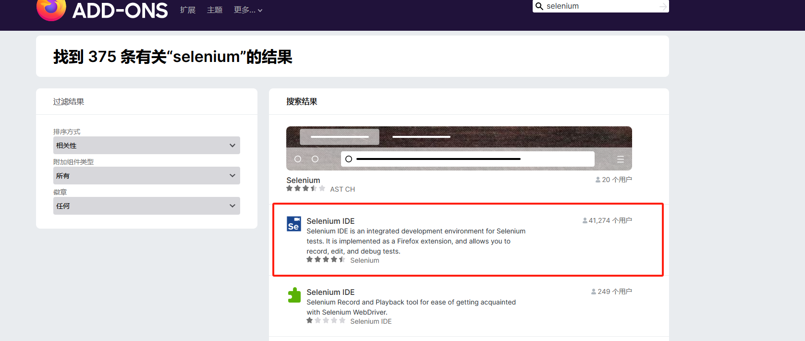

# Selenium基础
## Selenium 家族
1. Selenium 框采其实是由多个工其组成的，分别是 Selenium IDE、Selenum Rc、SeeumWebDriver 和 Selenium Grid。
2. Selenium IDE 它是 FireFox 浏览器中的一个插件，可以录制用户的基本操作，生成测试脚本。生成的脚本不仅可以直接在浏览器中进行回放，还可以转换成各种语言的自动化脚本并保存到本地。
3. Selenium RC 主要是由 Client Libraries 和 SeleniumServer 组成的,Client Libraries 主要通过编写测试脚本来控制 Selenium Server 库，而 SeleniumServer 主要负责控制浏览器的行为,该库又包括三部分: Launcher、Http Proxy和 Core。SeleniumCore 是一系列JavaScript 函数的集合,只有通过 JavaScript 函数才可以实现用程序对浏览器进行相应的操作。而 Launcher 的作用主要是启动浏览器，然后将 Selenium Core 加载到浏览器页面中，通过 Selenium Server 的 HttpProxy 完成对应浏览器的代理设置。
4. Selenium WebDriver 可以直接发送命令给浏览器。
5. Selenium Grid 用于运行不同的机器，不同的浏览器进行并行测试，目的就是加快测试用例的运行速度，从而减少测试运行的总时间。灵活利用 Grid 可以很简单地让多台机器在异构环境
## 安装Selenium及Selenium IDE
### 1. 安装Selenium
直接dos命令下执行安装命令
```dos
pip install selenium
```
### 2. 安装Selenium IDE
1. 安装Firefox
https://www.mozilla.org/zh-CN/firefox/new/?redirect_source=firefox-com

2. 选择附件组件


## 浏览器驱动
1. 在 Selenium 3.x版本中没有默认浏览器的支持，需要使用哪个浏览器完成自动化，就需要获取该浏览器官方提供的对应版本的驱动，这样会使各个浏览器在自动化测试中更加稳定。

注意:

 -  下载的浏览器的版本和位数，取决于使用的操作系统的类型和位数(64bit 或 32bit),虽然浏览器的版本位数和操作系统的位数没有映射关系，但是为了防止出现特殊问题，建议尽量保持版本一致。
 - 浏览器的版本和驱动版本存在映射关系，下载时需注意，如果两个版本不匹配Selenium将无法驱动浏览器。
 - Edge的驱动器需要使用以下命令更新。
   
   DISM.exe /Online /Add-Capability /CapabilityName:Microsoft.WebDriver~~~~0.0.1.0并且在DOS 中以管理员身份运行。

2. 下载完对应的驱动器后，还需要将其配置到 Path 的环境变量中，配置后需要重启 PyCharm 使其生效(除了可以自己新建文件夹以外，也可以直接放置在 Python 的可执行文件路径中 )。以下是各浏览器和驱动的下载地址: https://www.selenium.dev/documentation/en/webdriver/driver_requirements/。
并且在 DOS 中以管理员身份运行。访问后选 WebDriver，然后单击 Driver requirements 即可获取所有浏览器对应版本的下载地址， 
## Selenium的运行原理
1. 客户端(即用PyCharm 设计的脚本)发送请求，基于JSON Wire 格式的协议创建一个绑定特定端口的会话连接(Selenium RC)，相当于服务端。
2. 服务端又会根据不同的浏览器驱动来启动不同类型的浏览器，浏览器不同的类型 (4种内核: IE、Firefox、Chrome、Opera) 、不同的版本具有不同的驱动，此时服务器会将客户端发送过来的事件指令通过驱动在浏览器中完成，浏览器操作完成后会将结果返回给服务端，服务端将结果返回给客户端。